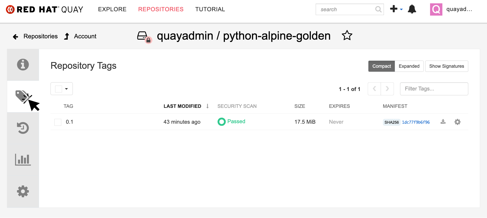
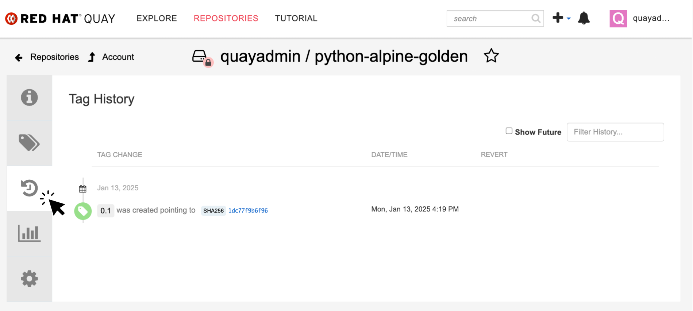
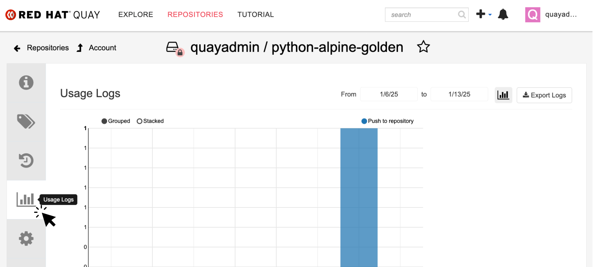
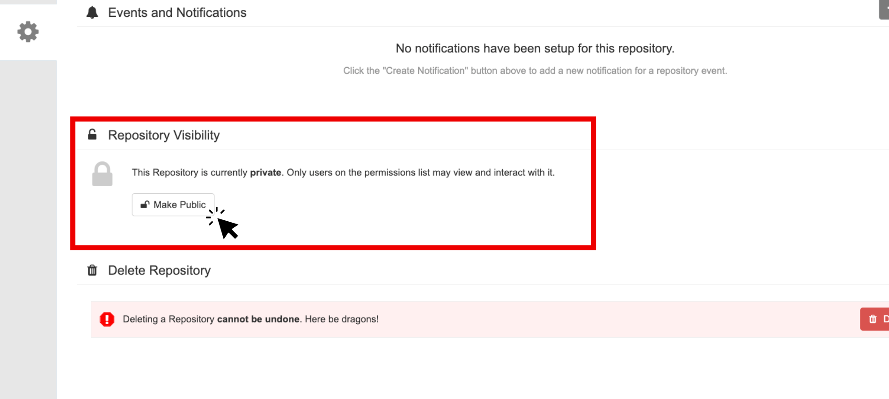

= Store, Scan and Deploy Applications with Red Hat Quay

In this module we will be acting as the devloper.

=== Download a base container image

=== Add the application code

=== Build a container image

In this section, we will download the "*TBD*" give it a new tag, and push the image to Quay. Later, we'll deploy the image to the OpenShift Cluster and use it in future modules.

Let's export a few variables to make things easier. These variables will stay in the .bashrc file so they're saved in case you need to refresh the terminal.

TIP: With the variables saved in the ~/.bashrc file you will not have to declare them again in the future. 

==== Login to Quay

*Procedure*

[start=1]
. Run the following command.

[source,sh,subs="attributes",role=execute]
----
echo export QUAY_USER={quay_admin_username} >> ~/.bashrc
QUAY_USER={quay_admin_username}
----

[start=2]

. Set the Quay URL variable 

[source,sh,subs="attributes",role=execute]
----
echo export QUAY_URL=$(oc -n quay-enterprise get route quay-quay -o jsonpath='{.spec.host}') >> ~/.bashrc
QUAY_URL=$(oc -n quay-enterprise get route quay-quay -o jsonpath='{.spec.host}')
----

IMPORTANT: Verify that the variables are correct

[source,sh,subs="attributes",role=execute]
----
echo $QUAY_USER
echo $QUAY_URL
----

[.console-output]
[source,bash,subs="+macros,+attributes"]
----
[lab-user@bastion ~]$ echo $QUAY_USER
echo $QUAY_URL
quayadmin
quay-bq65l.apps.cluster-bq65l.bq65l.sandbox209.opentlc.com
----

[start=3]
. Using the terminal on the bastion host, login to quay using the Podman CLI as shown below:

[source,sh,subs="attributes",role=execute]
----
podman login $QUAY_URL
----

NOTE: Use the quay admin credentials to sign in. 

[cols="2,2"]
|===
*Quay Console Username:* | *{quay_admin_username}* |
*Quay Console Password:* | *{quay_admin_password}* |
|===

[.console-output]
[source,bash,subs="+macros,+attributes"]
----
Username: quayadmin
Password:
Login Succeeded!
----

==== Pull the base image

[start=4]
. Pull the TBD container image with the following CLI command:

[source,sh,subs="attributes",role=execute]
----
podman pull quay.io/jechoisec/ctf-web-to-system-01
----

[.console-output]
[source,bash,subs="+macros,+attributes"]
----
Trying to pull quay.io/jechoisec/ctf-web-to-system-01:latest...
Getting image source signatures
Copying blob 37aaf24cf781 done 
...
...
Copying config 1cbb2b7908 done  
Writing manifest to image destination
1cbb2b79086961e34d06f301b2fa15d2a7e359e49cfe67c06b6227f6f0005149
----

[start=5]
. Now that you have a copy of the TBD container image locally. You must tag the image before pushing it to Quay. 

[source,sh,subs="attributes",role=execute]
----
podman tag quay.io/jechoisec/ctf-web-to-system-01 $QUAY_URL/$QUAY_USER/ctf-web-to-system:1.0
----

NOTE: Quay will automatically create a private registry to store our TBD application since we have admin access. To deploy the app, you'll need to make the repository public so you can pull the image without credentials.

[start=6]
. The last step is to push the image to Quay.

[source,sh,subs="attributes",role=execute]
----
podman push $QUAY_URL/$QUAY_USER/ctf-web-to-system:1.0 --remove-signatures
----

[.console-output]
[source,bash,subs="+macros,+attributes"]
----
Copying blob 3113fb957b33 done 
...
...
Copying config 1cbb2b7908 done  
Writing manifest to image destination
----

[start=6]

Perfect! 

== Access Quay 

Your Red Hat Quay console is available at: {quay_console_url}[window=blank]

Administrator login is available with:

[source,sh,subs="attributes",role=execute]

[cols="1,1"]
|===
*Quay Console Username:* | {quay_admin_username} |
*Quay Console Password:* | {quay_admin_password} |
|===

[[navigating-the-registry]]

== Browse the registry

In the setup module we downloaded built and pushed a insecure java application called *ctf-web-to-system*. Now it's time to deploy it to the OpenShift Cluster. To do this we will need to make the registry that we created public. 

Let's take a look at our application in the registry.

image::quay-login.png[link=self, window=blank, width=100%]

. Next, click on the *ctf-web-to-system* repository. 

image::quay-repo.png[link=self, window=blank, width=100%]

On the left hand side of the window you should see the following icons labelled in order from top to bottom,

image::quay-sidebar.png[link=self, window=blank, width=100%]

- Information
- Tags
- Tag History
- Usage Logs
- Settings

The information tab shows you information such as;

- Podman and Docker commands
- Repository activity
- The repository description. 

image::quay-information.png[link=self, window=blank, width=100%]

[start=2]
. Click on the *Tags* icon. 

This tab displays all of the images and tags that have been upladed, providing information such as fixable vulnerabilities, the image size and allows for bulk changes to images based on the security posture. 

image::quay-tags-security.png[link=self, window=blank, width=100%]

[start=3]
. Click on the *Tags History* icon. 

This tab simply displays the container images history over time. 

[start=4]
. Click on the *Usage Logs* icon. 

This tab displays the usage over time along with details about who/how the images were pushed to the cluster. 

You can see that you (The "quayadmin") pushed an image tagged 1.0 to the repository today. 

[start=5]
. Lastly click on the *Settings* icon. 

image::quay-settings.png[link=self, window=blank, width=100%]

In this tab you can add/remove users and update permissions, alter the privacy of the repository, and even schedule alerts based on found vulnerabilities.

image::quay-tags-security.png[link=self, window=blank, width=100%]

IMPORTANT: Make sure to make the repository public. Otherwise we will not be able to deploy the application in the next step.

[start=6]
. Make your repository public before deploying our application in the next step by clicking the *Make Public* button under `Repository Visability`

[start=7]
. Click OK

image::quay-make-public-ok.png[link=self, window=blank, width=100%]

[[vulnerability-scanning-with-quay]]

== Vulnerability Scanning with Quay

Red Hat Quay can also help with securing our environments by performing a security scan on any images added to our registry, and advise which ones are potentially fixable.

Use the following procedure to check the security scan results for our Java container image you have uploaded.

. Click on the *Tags* icon on the left side of the screen like before.

NOTE: You may need to click the checkbox near the image you would would like more information on, but the column for *Security Scan* should populate.

[start=2]
. By default, the security scan color codes the vulnerabilities, you can hover over the security scan for more information.

image::quay-scan-hover.png[link=self, window=blank, width=100%]

NOTE: The Java container image we are using in this lab shows 12 vulnerabilities, with 1 high vulnerabilities. This number will change with time and will be different between container scanners for a variety of reasons such as reporting mechanisms, vulnerability feeds and operating system support. 

. Click on the list of vulnerabilities to see a more detailed view.

image::quay-security-detailed.png[link=self, window=blank, width=100%, Image Security Details] 

. Click on a vulnerabile package on the left menu to get more information about the vulnerability and see what you have to do to fix the issue.

image::quay-vuln-detailed.png[link=self, window=blank, width=100%]

NOTE: Toggling for fixable/unfixable vulnerabilities is an excellent way for developers to understand what is within their responsibility for fixing. For example, since we are using an older version of Java, many fixes are available for these common issues. 

Congratulations, you now know how to examine images in your registry for potential vulnerabilities before deploying into your environment.

[subs=attributes]

IMPORTANT: Please ensure the deploy application are deployed to your cluster before moving onto the next module. 

[[deploy-the-java-application]]

